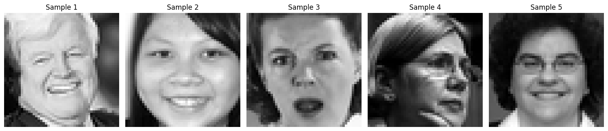
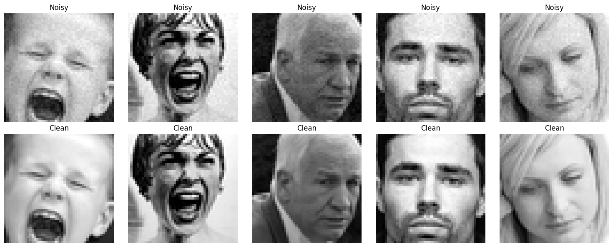
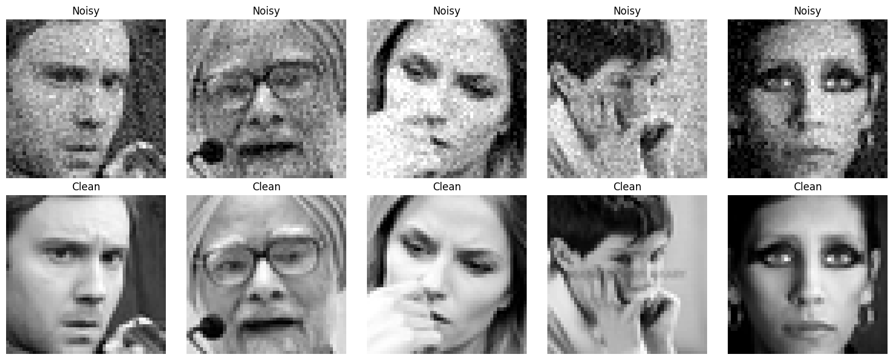
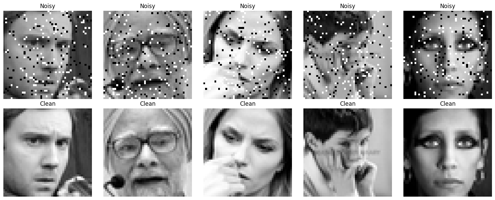
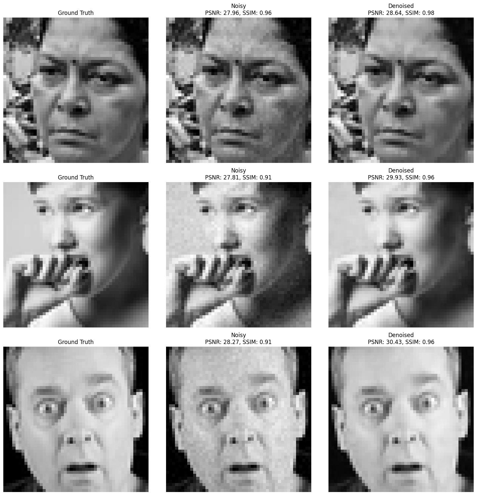
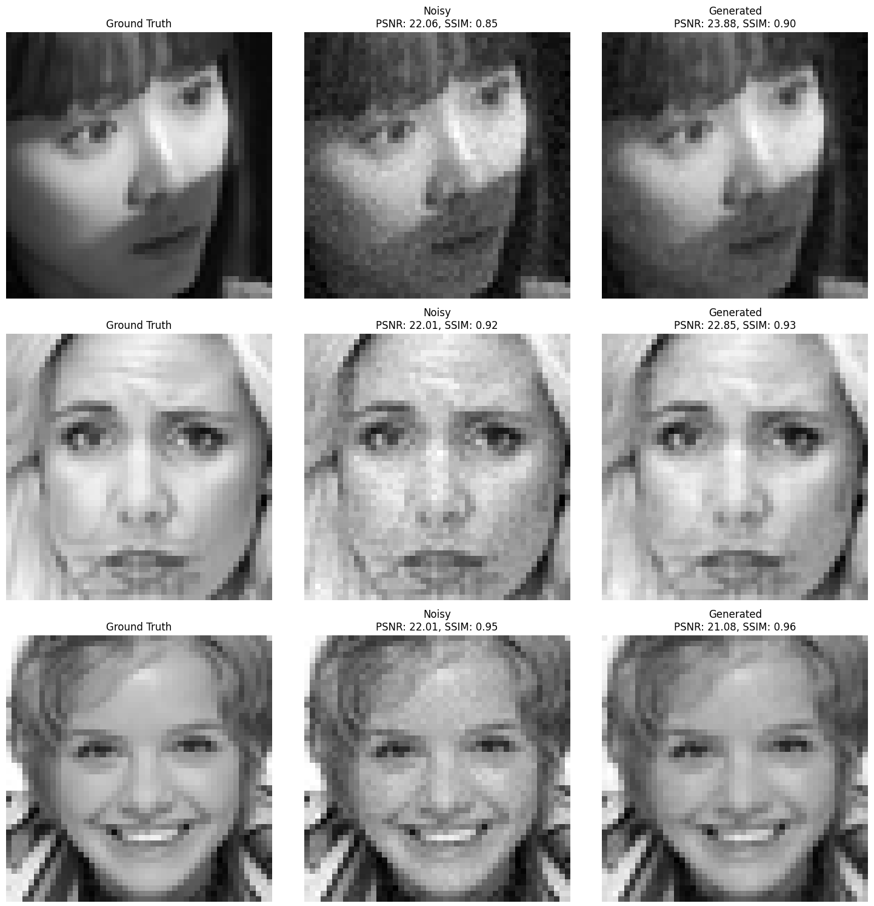
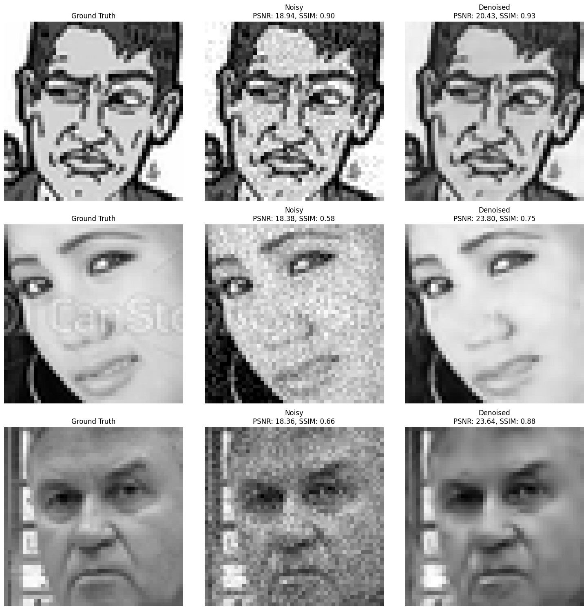
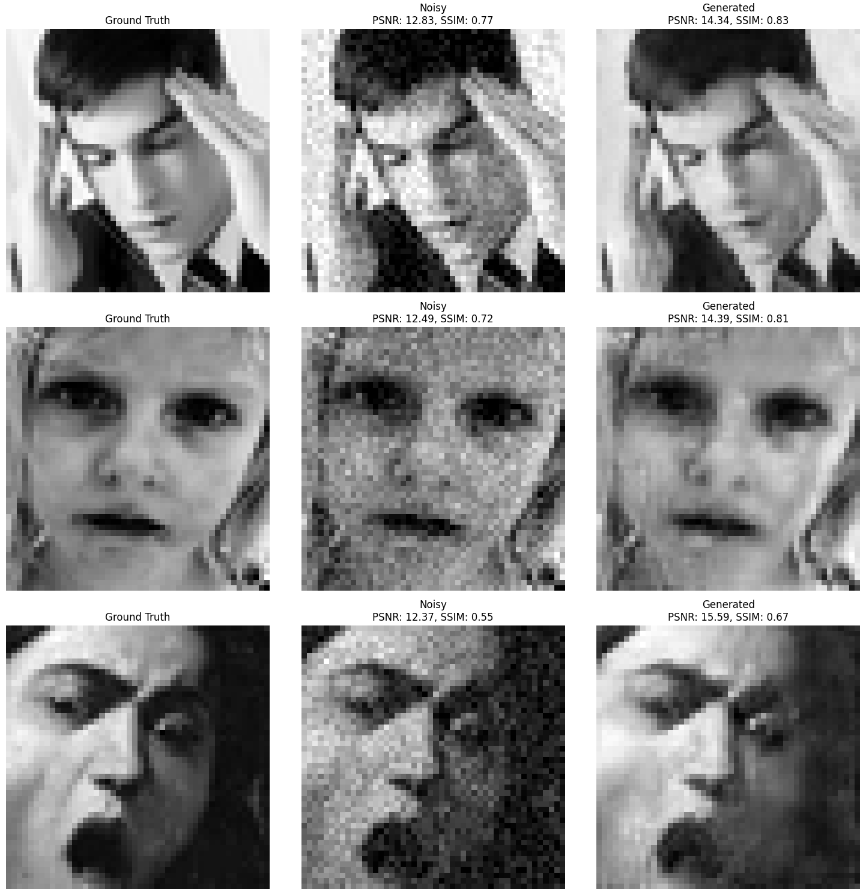
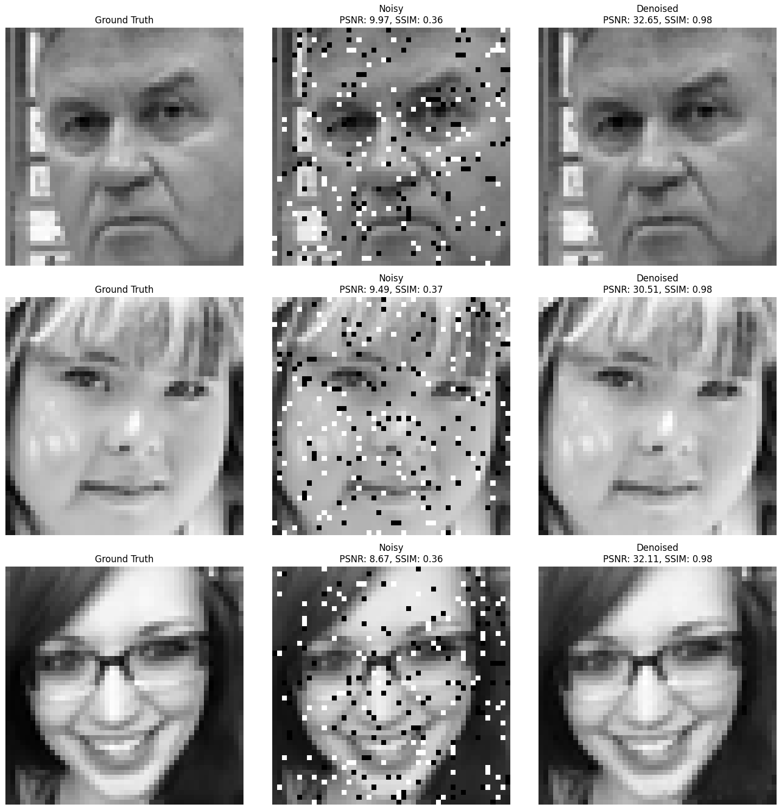
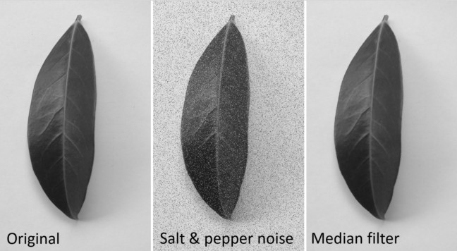

# **Denoising Facial Emotion Dataset Using Attention U-Net and GAN**

## **Introduction**

Welcome to an exciting journey into the world of deep learning and image restoration! 🎉 In this project, we dive into the challenge of denoising grayscale facial images, taking on various levels of noise that can obscure the rich emotional expressions captured in the data. Leveraging cutting-edge architectures like **Attention U-Net** and **GANs (Generative Adversarial Networks)**, we aim to breathe life back into noisy images and showcase the power of modern neural networks. 

The dataset at the heart of this project is derived from the well-known **FER2013 dataset**, consisting of pixel-based grayscale images of facial expressions. Our goal? To strip away the noise and let the underlying emotions shine through.

Why does this matter? Noise in images can wreak havoc on tasks like emotion recognition and facial analysis. By addressing three distinct types of noise—**low Gaussian noise**, **high Gaussian noise**, and **salt-and-pepper noise**—we're not just restoring clarity but also paving the way for more accurate downstream applications. 

Here's what makes this project special:
- **Attention U-Net Magic**: A model that zooms in on the most relevant parts of noisy images, ensuring precision and high fidelity.  
- **PatchGAN Wizardry**: A patch-based GAN approach that brings a unique perspective to denoising, ensuring both local and global coherence.  
- **Thorough Evaluation**: With metrics like **PSNR (Peak Signal-to-Noise Ratio)** and **SSIM (Structural Similarity Index Measure)**, alongside stunning visualizations, we provide a comprehensive assessment of our models' performance.  

By the end of this project, you’ll see how these advanced models tackle complex noise scenarios and how you can use these insights for your own image restoration challenges. Let’s bring these faces into focus! 😊

---

## **Setup**

### **Run This Project in Google Colab 🚀**

Getting started is easy and stress-free! This notebook is designed to run seamlessly on Google Colab, so there’s no complicated setup required. Here's what you’ll need:  

1. A **Google Account** (we're sure you already have one 😉).  
2. A working **internet connection** (because, you know, it's the 21st century).  

Just hit the **Open in Colab** badge above and watch the magic unfold. Colab will take care of everything—from installing the required libraries to preparing the environment. Within minutes, you'll be ready to explore the world of denoising with Attention U-Net and GANs! 🌟

---

## **Data Preprocessing and Noise Augmentation**

The dataset consists of grayscale images of size **48x48 pixels**, initially preprocessed to remove unnecessary information while retaining the raw pixel data for model training. Each image represents a facial expression, providing valuable insights for denoising tasks. We performed the following steps for data preparation:

1. **Loading and Preprocessing**: The images were extracted from the FER2013 dataset and preprocessed to maintain uniformity in size and pixel intensity normalization. 
2. **Splitting**: The dataset was split into predefined **training**, **validation**, and **test** sets for consistency during experimentation.

### **Sample Images**
Below are some examples of the raw grayscale images from the dataset:



---

To study the denoising effects systematically, we introduced **three distinct types of noise** into the images, mimicking real-world scenarios of image corruption. These noise augmentations help evaluate the robustness of the denoising models:

1. **Low Gaussian Noise**: Mild Gaussian noise with a standard deviation of 0.2 and noise factor of 0.2.
2. **High Gaussian Noise**: Intense Gaussian noise with a standard deviation of 0.4 and noise factor of 0.3.
3. **Salt-and-Pepper Noise**: A random noise pattern with a noise factor of 0.1 and an equal mix of "salt" (white) and "pepper" (black) pixels.

### **Sample Images with Noise Augmentations**
#### Gaussian Noise (Low)


#### Gaussian Noise (High)


#### Salt-and-Pepper Noise


### **Models Overview**

This project explores two powerful architectures for image denoising: **Attention U-Net** and **PatchGAN**. These models are specifically tailored to handle noisy grayscale facial images, enabling effective restoration of visual features. Below is a detailed explanation of their structure and design choices, supported by code.

---

### **1. Attention U-Net**

The **Attention U-Net** builds upon the classic U-Net architecture by incorporating **attention mechanisms**, enabling the model to focus on relevant regions of the input dynamically. This enhancement ensures effective noise suppression while preserving essential structural and contextual features, making it highly suitable for image denoising tasks.

#### **Architecture**
The Attention U-Net is divided into four components:

```python
class AttentionUNet(nn.Module):
    def __init__(self, in_channels=1, out_channels=1, use_attention=True, debug=False):
        super(AttentionUNet, self).__init__()
        self.debug = debug
        # Encoder
        self.enc1 = EncoderBlock(in_channels, 16)
        self.enc2 = EncoderBlock(16, 32)
        self.enc3 = EncoderBlock(32, 64)
        self.enc4 = EncoderBlock(64, 128)
        # Bottleneck
        self.bottleneck = ConvBlock(128, 256)
        # Decoder
        self.dec4 = DecoderBlock(256, 128, use_attention=use_attention, debug=debug)
        self.dec3 = DecoderBlock(128, 64, use_attention=use_attention, debug=debug)
        self.dec2 = DecoderBlock(64, 32, use_attention=use_attention, debug=debug)
        self.dec1 = DecoderBlock(32, 16, use_attention=False, debug=debug)
        # Final Output
        self.final_conv = nn.Conv2d(16, out_channels, kernel_size=1)
```

1. **Encoder**: 
   - Each `EncoderBlock` consists of convolutional layers for feature extraction and max-pooling for downsampling.
   - Optional **attention modules** refine features by focusing on spatially important regions based on the input context.

```python
class EncoderBlock(nn.Module):
    def __init__(self, in_channels, out_channels, use_attention=False, stride=2, padding=0, debug=False):
        super(EncoderBlock, self).__init__()
        self.conv = ConvBlock(in_channels, out_channels)
        self.pool = nn.MaxPool2d(kernel_size=2, stride=stride, padding=padding)
        if use_attention:
            self.attention = AttentionBlock(out_channels, out_channels, out_channels)
```

2. **Bottleneck**: 
   - A dense `ConvBlock` bridges the encoder and decoder, aggregating global context to capture high-level features.

3. **Decoder**:
   - Each `DecoderBlock` upsamples the feature maps using transposed convolutions, enabling reconstruction at higher resolutions.
   - Skip connections integrate fine-grained details from the encoder for precise restoration.
   - Attention mechanisms selectively refine the reconstructed features, helping prioritize meaningful information.

```python
class DecoderBlock(nn.Module):
    def __init__(self, in_channels, out_channels, use_attention=False, debug=False):
        super(DecoderBlock, self).__init__()
        self.upconv = nn.ConvTranspose2d(in_channels, out_channels, kernel_size=2, stride=2)
        self.conv = ConvBlock(out_channels * 2, out_channels)
        if use_attention:
            self.attention = AttentionBlock(out_channels, out_channels, out_channels)
```

4. **Output Layer**:
   - A single convolutional layer reduces the feature map to the target image dimensions, reconstructing the output to match the original image size (1 * 48 * 48).

---

#### **Training Highlights**
The Attention U-Net was trained using a carefully designed configuration:

- **Loss Function**: Mean Squared Error (MSE) ensures pixel-wise consistency between the denoised output and the clean ground truth. This choice balances simplicity and effectiveness for grayscale image restoration.
  
- **Optimization**:
  - **Optimizer**: Adam optimizer with an initial learning rate of `1e-3` ensures fast convergence.
  - **Scheduler**: A ReduceLROnPlateau scheduler dynamically lowers the learning rate when validation loss stagnates, preventing overfitting and improving generalization.

---

### **2. PatchGAN**

The **PatchGAN** framework combines the power of a generator (Attention U-Net) and a discriminator to refine the denoising process. The generator produces denoised outputs, while the discriminator evaluates their authenticity by focusing on both global structure and local detail. This dynamic adversarial training ensures that the denoised images are visually realistic and contextually accurate.

#### **Generator**
The **Attention U-Net**, discussed earlier, serves as the generator in this setup. Its attention mechanisms allow it to focus on noise-free regions of the input, ensuring high-quality reconstruction of the denoised output.

#### **Discriminator**
The discriminator, **PatchGANDiscriminator**, takes the denoised output from the generator and evaluates it against the ground truth (clean image). It does this by processing pairs of noisy-clean images or noisy-generated images and assessing their "realness" at a patch level.

```python
class PatchGANDiscriminator(nn.Module):
    def __init__(self, in_channels=2, base_channels=32, stride=[2, 2, 2, 2, 2, 2], padding=[0, 0, 0, 0, 0, 0], use_fc=False, global_pooling=False, debug=False):
        super(PatchGANDiscriminator, self).__init__()
        self.debug = debug
        self.use_fc = use_fc
        self.global_pooling = global_pooling
        # Encoder layers
        self.enc1 = EncoderBlock(in_channels, base_channels, use_attention=True, stride=stride[0], padding=padding[0], debug=debug)
        self.enc2 = EncoderBlock(base_channels, base_channels * 2, use_attention=False, stride=stride[1], padding=padding[1], debug=debug)
        self.enc3 = EncoderBlock(base_channels * 2, base_channels * 4, use_attention=True, stride=stride[2], padding=padding[2], debug=debug)
        # Final convolution
        self.final_conv = nn.Conv2d(base_channels * 2, 1, kernel_size=2, stride=stride[5], padding=padding[5])
        # Fully connected layers
        if self.use_fc:
            self.fc_dim = 12 * 12
            self.fc = nn.Sequential(
                # nn.Linear(base_channels * 8 * (22 * 22), self.fc_dim),
                nn.Linear(base_channels * 2, self.fc_dim),
                nn.Tanh(),  # Activation function
                nn.Linear(self.fc_dim, self.fc_dim),
                nn.Tanh()
            )

    def forward(self, x, y):
        combined = torch.cat([x, y], dim=1) 
        # Encoder forward pass
        features, downsampled = self.enc1(combined)
        features, downsampled = self.enc2(downsampled)
        features, downsampled = self.enc3(downsampled)
        out = self.final_conv(features)  # Shape: (B, 1, H', W')
        if self.use_fc:
            batch_size, channels, height, width = features.shape
            if self.global_pooling:
                pooled_features = torch.mean(features, dim=[2, 3]) 
                flattened = pooled_features.view(batch_size, -1)
            else:
                flattened = features.view(batch_size, -1) 
            fc_out = self.fc(flattened)  
            out = fc_out.view(batch_size, 1, height, width)
        return out

```

The discriminator operates on **two inputs**, concatenated channel-wise:  
1. A noisy image (real or generated).  
2. A clean image (ground truth or generated).  

By processing these inputs through its encoder layers, the discriminator outputs a matrix of **patch-based predictions**, where each score corresponds to the "realness" of a patch in the image.

To stabilize training, **label smoothing** is applied:  
- Real patches are labeled as **0.9**, preventing the discriminator from becoming overly confident.  
- Fake patches are labeled as **0.1**, encouraging the generator to refine its outputs.

---

The training process involves a careful balance between the generator and discriminator. The **generator loss** combines two objectives:  
1. **Reconstruction loss (L2)**: Ensures pixel-level accuracy by minimizing the difference between the denoised output and the clean image.  
2. **Adversarial loss**: Encourages the generator to produce images that the discriminator classifies as "real".  

The **discriminator loss** evaluates how effectively the discriminator distinguishes between real and fake patches. It combines the binary cross-entropy losses for real and fake predictions.

```python
gen_loss = l2_loss + 0.001 * adversarial_loss
disc_loss = (real_loss + fake_loss) / 2
```

Training is optimized using Adam for both generator and discriminator, with a learning rate of `1e-3`. A **ReduceLROnPlateau** scheduler is used to dynamically adjust the learning rate when validation loss plateaus, ensuring better generalization.  

This combination of patch-based evaluation, adversarial loss, and careful optimization results in a robust denoising process, capable of producing visually coherent and contextually accurate outputs.


## Task 1: Denoising Low Gaussian Noise

In this task, we focus on denoising grayscale images with **low Gaussian noise**, which mimics mild real-world distortions. Both the **Attention U-Net** and **PatchGAN** models were trained and evaluated for this purpose. Below, we present the denoised results and analyze the performance of the models.

### **Reconstruction Results**

#### Attention U-Net
The **Attention U-Net** showed impressive performance in denoising low Gaussian noise. Below are some reconstructed samples:


#### PatchGAN
The **PatchGAN** model was also tested, and while it produced satisfactory outputs, the **Attention U-Net** was more consistent in metrics. Here are some results from the PatchGAN model:
 


---

### **Performance Metrics**

The evaluation was conducted on the **test set**, and the results for both models are summarized below:

| Model         | Loss   | PSNR    | SSIM    | Explanation                                                                                                                                          |
|---------------|--------|---------|---------|------------------------------------------------------------------------------------------------------------------------------------------------------|
| Attention U-Net | 0.0039 | 30.1480 | 0.9593 | In low-noise scenarios, Attention U-Net excels due to its focused attention mechanisms, achieving high fidelity and structural similarity.            |
| PatchGAN       | 0.0064 | 21.9678 | 0.9221 | The PatchGAN struggled slightly due to its reliance on adversarial training, which can overemphasize visual realism over quantitative accuracy.       |

---

## Task 2: Denoising High Gaussian Noise

In the second task, we tackle denoising grayscale images corrupted with **high Gaussian noise**, simulating more severe real-world distortions. The models, **Attention U-Net** and **PatchGAN**, were further trained on this task to evaluate their ability to reconstruct heavily corrupted images.

---

### **Reconstruction Results**

#### Attention U-Net
The **Attention U-Net** adapted well to the high Gaussian noise, leveraging its attention mechanisms to focus on key areas of the image. Here are some sample reconstructions:


#### PatchGAN
The **PatchGAN** model showed modest improvements but struggled with the intensity of the noise. Below are some generated outputs:


---

### **Performance Metrics**

The evaluation was conducted on the **test set**, and the comparative results for both models are summarized in the table below:

| Model           | Loss   | PSNR    | SSIM    | Explanation                                                                                                                                                   |
|------------------|--------|---------|---------|---------------------------------------------------------------------------------------------------------------------------------------------------------------|
| Attention U-Net | 0.0161 | 23.9465 | 0.8720  | The U-Net demonstrates its robustness in handling high noise levels, although the task complexity caused a drop in metrics compared to Task 1.               |
| PatchGAN        | 0.0270 | 15.6816 | 0.7745  | PatchGAN exhibited limitations in resolving fine details under severe noise conditions. A less complex GAN structure might yield more competitive results.    |

---

The results indicate that while both models experience a decline in performance due to the increased noise severity, the **Attention U-Net** consistently outperforms the **PatchGAN**. The challenges posed by high Gaussian noise emphasize the need for refined GAN architectures for better denoising outcomes.

## Task 3: Denoising Salt-and-Pepper Noise

Expanding the exploration further, this task addresses **salt-and-pepper noise**, a common form of impulse noise. While traditional methods like median filtering are effective for such noise, we assess the potential of deep learning models, specifically **Attention U-Net**, to achieve competitive denoising results.

---

### **Reconstruction Results**

#### Attention U-Net
The **Attention U-Net** performed remarkably well, effectively restoring images corrupted by salt-and-pepper noise. Below are the denoised results from the Attention U-Net:


---

### **Performance Metrics**

The results on the **test set** for the Attention U-Net are summarized below:

| Model           | Loss   | PSNR    | SSIM    | Explanation                                                                                                                                                    |
|------------------|--------|---------|---------|----------------------------------------------------------------------------------------------------------------------------------------------------------------|
| Attention U-Net | 0.0037 | 30.3950 | 0.9774  | The model demonstrated strong capabilities in handling impulse noise, achieving high fidelity and structural similarity, comparable to classical filtering methods. |

---

### **Insights and Future Work**

While salt-and-pepper noise is traditionally managed through simple filtering techniques:


this task highlights the potential of neural networks like the Attention U-Net for broader denoising challenges. However, the **GAN model** did not achieve satisfactory results in this task, likely due to the sparse and abrupt nature of the noise. Future work could explore specialized architectures or pre-processing techniques to enhance GAN performance on impulse noise.


